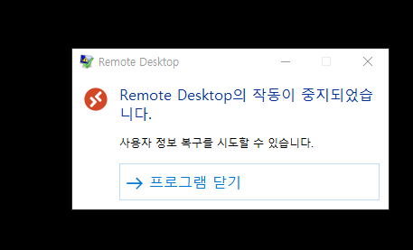

## ntdll.md linuxEngine pipe not found

docker 설치 중 "remote desktop 작동이 중지 되었습니다." 팝업이 가상머신에 붙어있을 때 지속적으로 나오는 에러

- 솔루션: Windows Vista, Windows 7 또는 Windows 8에서 클린 부팅을 수행하여 - 문제를 해결하는 방법(8.1 적용 가능)
  http://support.microsoft.com/kb/929135/ko
- [제어판-프로그램 및 기능]에서 인코더,디코더, 필터 드라이버 등.. 과 관련하여 설치된 프로그램이 있다면 제거 합니다.
- C:\Program Files (x86)\BandiMPEG1\bdfilters64.dll 파일이 존재하는 경우 이름을 bdfilters64.old 으로 변경합니다.

---

**docker에 한정된 에러가 아님.
ubuntu 설치 과정에서도 나옵니다. 가상화 엔진을 사용하는 과정에선 전부 나오는 듯? 하다..**
