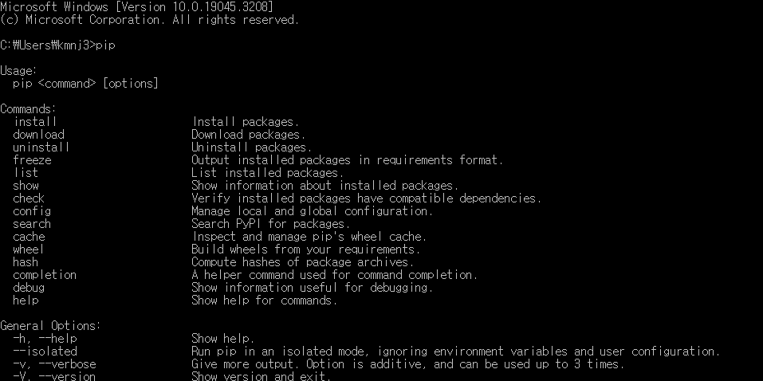

## .exe create file


cmd > "**pip**" input command




<br>

<br>

cmd > pip install pyinstaller


```win32
    > pyinstaller createFile.py // default 생성 방법 패키지까지 생성함
    > pyinstaller --onefile createFile.py // build folder와 .exe파일 하나만 생성됨
    > --name excuteFile // .exe 파일 만들면서 이름 변경 가능
    > --noconcole // .exe 파일 실행 하면 console 창 안뜸. default는 뜸
```